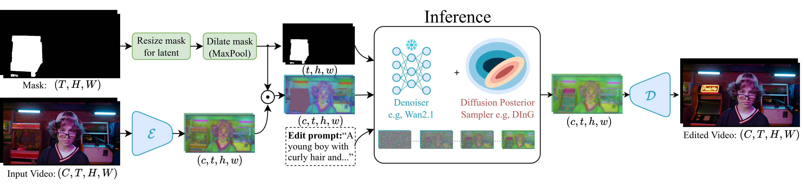

# DInG-Editor

<p align="left">
<a href='https://ahmedgh970.github.io/ding-editor'></a> &nbsp;
<a href="https://arxiv.org/abs/2602.14157"></a> &nbsp;
</p>

Training-free image/video/audio editing made fast and efficient.

Official code of the paper *"When Test-Time Guidance Is Enough: Fast Image and Video Editing with Diffusion Guidance"* 
published in [ReALM-GEN](https://realm-gen-workshop.github.io) ICLR 2026 workshop

Keywords: Image/Video/Audio Inpainting, Image/Video/Audio Editing, Image/Video/Audio Evaluation


**📖 Table of Contents**
- [DInG-Editor](#ding-editor)
  - [🔥 Update Log](#update-log)
  - [📌 TODO](#todo)
  - [🛠️ Method Overview](#method-overview)
    - [Features](#features)
    - [Directory Structure](#directory-structure)
  - [🚀 Getting Started](#getting-started)
    - [Environment Requirement](#environment-requirement)
    - [I3D Model Ckpt Download](#i3d-model-ckpt-download)
    - [Runners](#runners)
    - [Denoiser Registry](#denoiser-registry)
    - [Sampler Registry](#sampler-registry)
    - [Config Highlights](#config-highlights)
    - [Scripts](#scripts)
  - [🤝🏼 Cite Us](#cite-us)
  - [💖 Acknowledgement](#acknowledgement)

## 🔥 Update Log
- [2026/02/11] DInG-Editor is released, an efficient framework for image, video, and audio inpainting/editing.

## 📌 TODO
- [ ] Release Gradio demo.
- [ ] Release audio dataset inpainting code.
- [ ] Release audio evaluation code.

## 🛠️ Method Overview

`ding` is a toolkit for posterior-sampling inpainting and editing on images, videos, and audio. It wraps multiple diffusion backbones behind a common sampler API, with Hydra runners for single-instance and dataset workflows.

<section align="center">
    
</section>
</details>

### Features

- Unified `ding` sampler interface across image, video, and audio tasks.
- Denoiser registry for Flux, SD3 family, LTX-Video, Wan2.1, and Stable Audio 1.
- Hydra-ready runners for inpainting and dataset evaluation.
- Utility scripts for mask creation, dataset preprocessing, and experiment launching.

### Directory Structure

```text
ding/
├── assets/                 # README assets
├── configs/                # Hydra configs for inpaint/evaluate runners
├── scripts/                # Helper CLIs and experiment launch scripts
├── src/ding/
│   ├── api/                # Sampler interfaces and builder helpers
│   ├── denoisers/          # Denoiser wrappers
│   ├── runner/             # Hydra entry points
│   ├── samplers/           # Sampler implementations
│   └── utils/              # IO, masks, metrics, and misc helpers
└── README.md
```

## 🚀 Getting Started

<details>
<summary><b>Environment Requirement</b></summary>

```bash
python -m venv .venv
source .venv/bin/activate
pip install -e .
```
</details>

<details>
<summary><b>I3D Model Ckpt Download</b></summary>

```bash
wget -O i3d_rgb_imagenet.pt "https://huggingface.co/TencentARC/VideoPainter/resolve/main/i3d_rgb_imagenet.pt"
```
</details>

<details>
<summary><b>Runners</b></summary>

#### Image Inpainting (single sample)
```bash
python -m ding.runner.inpaint_img
```

#### Video Inpainting (single sample)
```bash
python -m ding.runner.inpaint_vid
```

#### Audio Inpainting (single sample)
```bash
python -m ding.runner.inpaint_audio
```

#### Image Dataset Inpainting
```bash
python -m ding.runner.inpaint_img_dataset
```

#### Video Dataset Inpainting
```bash
python -m ding.runner.inpaint_vid_dataset
```

#### Image Dataset Evaluation
```bash
python -m ding.runner.evaluate_img_dataset
```

#### Video Dataset Evaluation
```bash
python -m ding.runner.evaluate_vid_dataset
```
</details>

<details>
<summary><b>Denoiser Registry</b></summary>

#### Available denoiser names:
- `flux`
- `sd3_medium`
- `sd3.5_medium`
- `sd3.5_large`
- `sd3.5_large_turbo`
- `ltx`
- `wan`
- `sa1`
</details>

<details>
<summary><b>Sampler Registry</b></summary>

#### Available sampler names:
- `ding`
- `flair`
- `flow_chef`
- `diffpir`
- `ddnm`
- `blended_diffusion`
</details>

<details>
<summary><b>Config Highlights</b></summary>

- `configs/inpaint_img.yaml`: single-image inpainting.
- `configs/inpaint_vid.yaml`: single-video inpainting.
- `configs/inpaint_audio.yaml`: single-audio inpainting.
- `configs/inpaint_img_dataset.yaml`: dataset image inpainting.
- `configs/inpaint_vid_dataset.yaml`: dataset video inpainting.
- `configs/evaluate_img_dataset.yaml`: image dataset evaluation (FID/pFID/edit-pFID and per-image metrics).
- `configs/evaluate_vid_dataset.yaml`: video dataset evaluation (vFID and per-video metrics).
</details>

<details>
<summary><b>Scripts</b></summary>

- `scripts/draw_img_mask.py`: interactive helper to draw image masks.
- `scripts/preprocess_video_dataset.py`: preprocessing helper for video datasets.
- `scripts/image_experiments/run_inpaint_img_dataset.sh`: launch image dataset inpainting experiments.
- `scripts/image_experiments/run_evaluate_img_dataset.sh`: launch image dataset evaluation experiments.
- `scripts/video_experiments/run_inpaint_vid_dataset.sh`: launch video dataset inpainting experiments.
- `scripts/video_experiments/run_evaluate_vid_dataset.sh`: launch video dataset evaluation experiments.
</details>


## 🤝🏼 Cite Us

DInG is is part of a series of publications that explore training-free approach to guide pre-trained diffusion models, If you use it please cite


```bibtex
@article{moufad2026ding,
  title={Efficient Zero-Shot Inpainting with Decoupled Diffusion Guidance},
  author={Moufad, Badr and Shouraki, Navid Bagheri and 
          Durmus, Alain Oliviero and Hirtz, Thomas and 
          Moulines, Eric and Olsson, Jimmy and Janati, Yazid},
  journal={ICLR 2026},
  year={2026}
}

@article{ghorbel2026ding-editor,
  title={When Test-Time Guidance Is Enough:
         Fast Image and Video Editing with Diffusion Guidance},
  author={Ghorbel, Ahmed and Moufad, Badr and Shouraki, Navid Bagheri 
          and Durmus, Alain Oliviero and Hirtz, Thomas and 
          Moulines, Eric and Olsson, Jimmy and Janati, Yazid},
  journal={ICLR 2026, ReALM-GEN Workshop},
  year={2026}
}
```

## 💖 Acknowledgement
<span id="acknowledgement"></span>

Our denoiser wrappers are implemented based on [diffusers](https://github.com/huggingface/diffusers).
